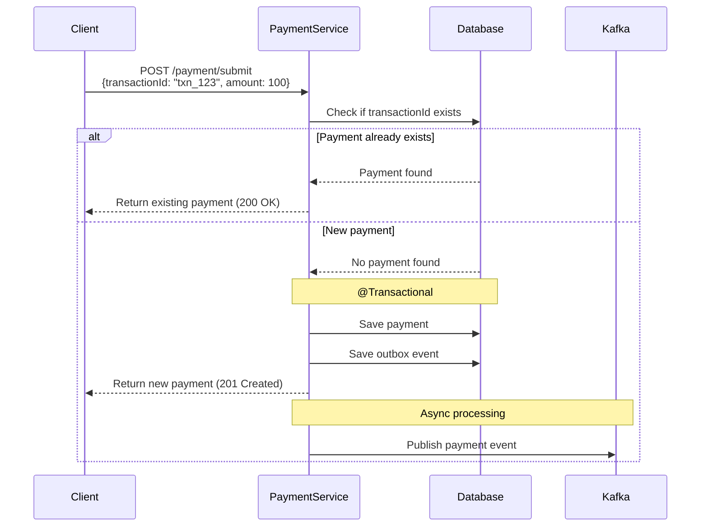

# Secure Payment Service - Spring Boot Microservice

A production-ready payment microservice built with Spring Boot, implementing enterprise-grade architectural patterns and containerized with Docker for scalable deployment.

## 🏗️ Architecture Overview

This microservice demonstrates modern software architecture patterns and best practices:

### Core Architectural Patterns

- **CQRS (Command Query Responsibility Segregation)**: Separates read and write operations for better scalability
- **Transactional Outbox Pattern**: Ensures data consistency between database operations and message publishing
- **Event-Driven Architecture**: Asynchronous communication via Apache Kafka
- **Repository Pattern**: Clean data access layer abstraction
- **Dependency Injection**: Loose coupling through Spring's IoC container

### Technology Stack

- **Framework**: Spring Boot 3.5.6
- **Language**: Java 17
- **Database**: PostgreSQL 13
- **Message Broker**: Apache Kafka with Zookeeper
- **Build Tool**: Maven 3.8.5
- **Containerization**: Docker & Docker Compose
- **ORM**: Spring Data JPA with Hibernate

## 📋 Features

### Payment Operations
- **Submit Payment**: Process new payment requests with validation
- **Confirm Payment**: Finalize payment transactions
- **Get Payments**: Retrieve payment history and status

### Enterprise Patterns
- **Idempotency**: Prevents duplicate payment processing using transaction IDs
- **Transactional Outbox**: Guarantees message delivery even during system failures
- **Event Sourcing**: Publishes payment events to Kafka for downstream processing
- **CQRS Implementation**: Separate command and query handlers
- **Database Migrations**: Flyway-compatible SQL migrations

### Reliability & Monitoring
- **Health Checks**: Docker container health monitoring
- **Retry Logic**: Automatic retry for failed Kafka publishing
- **Transaction Safety**: ACID compliance for payment operations
- **Graceful Degradation**: Service continues operating during Kafka outages

## 🚀 Quick Start

### Prerequisites
- Docker & Docker Compose
- Java 17 (for local development)
- Maven 3.8+ (for local development)

### Running with Docker (Recommended)

```bash
# Clone the repository
git clone <repository-url>
cd secure-payment-service-docker-spring

# Start all services
docker-compose up -d

# Check service health
docker-compose ps

# View logs
docker-compose logs -f secure-payment-service
```

### Running Locally (Development)

#### 1. Start Infrastructure Services
```bash
# Start only PostgreSQL and Kafka
docker-compose up -d postgres kafka zookeeper

# Wait for services to be ready (check health)
docker-compose ps
```

#### 2. Configure Local Application
Update `src/main/resources/application.properties`:
```properties
spring.datasource.url=jdbc:postgresql://localhost:5432/payment_db
spring.kafka.bootstrap-servers=localhost:9092
```

#### 3. Run Application
```bash
# Using Maven
./mvnw spring-boot:run

# Or build and run JAR
./mvnw clean package
java -jar target/secure-payment-service-docker-spring-0.0.1-SNAPSHOT.jar
```

## 📡 API Documentation

### Base URL
- Docker: `http://localhost:8080`
- Local: `http://localhost:8080`

### Endpoints

#### Submit Payment
```bash
POST /payment/submit
Content-Type: application/json

{
  "transactionId": "txn_12345",
  "amount": 50.75,
  "status": "PROCESSING",
  "sessionId": "session_abc123",
  "accountId": "acc_456789"
}
```

#### Confirm Payment
```bash
POST /payment/confirm
```

#### Get All Payments
```bash
GET /payment/payments
```

### Sample Request
```bash
curl -X POST http://localhost:8080/payment/submit \
  -H "Content-Type: application/json" \
  -d '{
    "transactionId": "txn_12345",
    "amount": 50.75,
    "status": "PROCESSING",
    "sessionId": "session_abc123",
    "accountId": "acc_456789"
  }'
```

## 🔧 Configuration

### Environment Variables

| Variable | Description | Default |
|----------|-------------|---------|
| `SPRING_DATASOURCE_URL` | PostgreSQL connection URL | `jdbc:postgresql://postgres:5432/payment_db` |
| `SPRING_DATASOURCE_USERNAME` | Database username | `user` |
| `SPRING_DATASOURCE_PASSWORD` | Database password | `password` |
| `SPRING_KAFKA_BOOTSTRAP_SERVERS` | Kafka broker addresses | `kafka:9092` |

### Application Properties
```properties
# Database Configuration
spring.datasource.url=jdbc:postgresql://postgres:5432/payment_db
spring.datasource.username=user
spring.datasource.password=password
spring.jpa.hibernate.ddl-auto=update
spring.jpa.properties.hibernate.dialect=org.hibernate.dialect.PostgreSQLDialect

# Kafka Configuration
spring.kafka.bootstrap-servers=kafka:9092
spring.kafka.consumer.group-id=payment-group
```

## 🏛️ Project Structure

```
src/
├── main/
│   ├── java/com/raeandres/secure_payment_service_docker_spring/
│   │   ├── controller/          # REST API controllers
│   │   │   └── PaymentController.java
│   │   ├── domain/              # Repository interfaces
│   │   │   ├── PaymentRepository.java
│   │   │   └── OutboxEventRepository.java
│   │   ├── messaging/           # Kafka producers/consumers
│   │   │   ├── KafkaProducerService.java
│   │   │   └── KafkaConsumerService.java
│   │   ├── model/               # Entity classes and DTOs
│   │   │   ├── PaymentEntity.java
│   │   │   ├── PaymentRequest.java
│   │   │   ├── PaymentResponse.java
│   │   │   ├── PaymentEvent.java
│   │   │   ├── OutboxEvent.java
│   │   │   └── PaymentStatus.java
│   │   ├── service/             # Business logic
│   │   │   ├── cqrs/            # CQRS pattern implementation
│   │   │   │   ├── Command.java
│   │   │   │   └── Query.java
│   │   │   ├── SubmitPaymentService.java
│   │   │   ├── ConfirmPaymentService.java
│   │   │   ├── GetPaymentService.java
│   │   │   └── OutboxService.java
│   │   └── SecurePaymentServiceDockerSpringApplication.java
│   └── resources/
│       ├── db/migration/        # Database migrations
│       │   └── V2__create_outbox_events_table.sql
│       └── application.properties
└── test/                        # Unit and integration tests
```

## Idempotent Transaction

### How It Works


## 🔄 Transactional Outbox Pattern

### How It Works

1. **Transaction Safety**: When `SubmitPaymentService.execute()` is called:
   - Payment is saved to database
   - Event is saved to outbox table
   - Both operations happen in same transaction (`@Transactional`)

2. **Event Publishing**: `OutboxService` runs every 5 seconds:
   - Finds unprocessed events
   - Publishes them to Kafka topic `payments-events`
   - Marks them as processed

3. **Reliability**: If Kafka is down, events remain in outbox until successfully published

### Key Benefits
- **Consistency**: Payment and event are saved atomically
- **Reliability**: Events won't be lost if Kafka is unavailable
- **Retry Logic**: Automatic retry through scheduled publishing

## 🐳 Docker Configuration

### Multi-Stage Dockerfile
```dockerfile
# Stage 1: Build the application
FROM maven:3.8.5-openjdk-17 AS build
WORKDIR /app
COPY pom.xml .
COPY src ./src
RUN mvn clean package -DskipTests

# Stage 2: Create the final image
FROM openjdk:17-jdk-slim
WORKDIR /app
COPY --from=build /app/target/*.jar app.jar
EXPOSE 8080
ENTRYPOINT ["java", "-jar", "app.jar"]
```

### Docker Compose Services
- **Zookeeper**: Kafka coordination service
- **Kafka**: Message broker for event streaming
- **PostgreSQL**: Primary database for payment data
- **Payment Service**: Main application container

## 🧪 Testing

### Test Architecture & Coverage

The project includes comprehensive unit and integration tests covering all architectural layers:

#### **Test Structure**
```
src/test/java/
├── controller/              # REST API layer tests
│   └── PaymentControllerTest.java
├── model/                   # Entity and DTO tests
│   ├── PaymentEntityTest.java
│   ├── PaymentRequestTest.java
│   ├── PaymentEventTest.java
│   ├── OutboxEventTest.java
│   └── PaymentStatusTest.java
├── service/                 # Business logic tests
│   ├── SubmitPaymentServiceTest.java
│   ├── ConfirmPaymentServiceTest.java
│   ├── GetPaymentServiceTest.java
│   ├── OutboxServiceTest.java
│   ├── IdempotencyServiceTest.java
│   └── cqrs/               # CQRS pattern tests
│       ├── CommandTest.java
│       └── QueryTest.java
├── domain/                  # Repository layer tests
│   ├── PaymentRepositoryTest.java
│   └── OutboxEventRepositoryTest.java
├── messaging/               # Kafka integration tests
│   ├── KafkaProducerServiceTest.java
│   └── KafkaConsumerServiceTest.java
└── integration/             # End-to-end tests
    └── PaymentIntegrationTest.java
```

#### **Test Categories**

**Unit Tests (18 classes)**
- **Controllers**: Mock-based testing of REST endpoints
- **Services**: Business logic validation with dependency mocking
- **Repositories**: JPA operations with H2 in-memory database
- **Models**: Entity validation and property testing
- **Messaging**: Kafka producer/consumer functionality

**Integration Tests (2 classes)**
- **Application Context**: Spring Boot application startup validation
- **End-to-End Flow**: Complete payment processing workflow

#### **Key Test Scenarios**

**Payment Processing**
- ✅ Successful payment submission
- ✅ Idempotent transaction handling (duplicate prevention)
- ✅ Payment confirmation workflow
- ✅ Payment retrieval and listing
- ✅ Input validation and error handling

**Transactional Outbox Pattern**
- ✅ Event persistence in database transaction
- ✅ Asynchronous event publishing to Kafka
- ✅ Retry logic for failed message delivery
- ✅ Event processing status tracking

**CQRS Implementation**
- ✅ Command pattern execution
- ✅ Query pattern implementation
- ✅ Separation of read/write operations

**Data Persistence**
- ✅ JPA entity CRUD operations
- ✅ Custom repository query methods
- ✅ Database constraint validation
- ✅ Transaction rollback scenarios

**Messaging & Events**
- ✅ Kafka message production
- ✅ Event consumption and processing
- ✅ Message serialization/deserialization
- ✅ Error handling in message processing

**Idempotency & Caching**
- ✅ Redis-based transaction tracking
- ✅ Duplicate request detection
- ✅ Cache key generation and validation

### Running Tests

#### **All Tests**
```bash
# Run complete test suite
./mvnw test

# Run with detailed output
./mvnw test -Dtest.verbose=true
```

#### **Specific Test Categories**
```bash
# Unit tests only
./mvnw test -Dtest="*Test"

# Integration tests only
./mvnw test -Dtest="*IntegrationTest"

# Controller layer tests
./mvnw test -Dtest="*ControllerTest"

# Service layer tests
./mvnw test -Dtest="*ServiceTest"

# Repository layer tests
./mvnw test -Dtest="*RepositoryTest"
```

#### **Individual Test Classes**
```bash
# Payment submission tests
./mvnw test -Dtest=SubmitPaymentServiceTest

# Outbox pattern tests
./mvnw test -Dtest=OutboxServiceTest

# Repository tests
./mvnw test -Dtest=PaymentRepositoryTest
```

### Test Configuration

#### **Test Database (H2)**
```properties
spring.datasource.url=jdbc:h2:mem:testdb
spring.datasource.driver-class-name=org.h2.Driver
spring.jpa.hibernate.ddl-auto=create-drop
```

#### **Test Profiles**
```bash
# Run with test profile
./mvnw test -Dspring.profiles.active=test

# Run with debug logging
./mvnw test -Dlogging.level.com.raeandres=DEBUG
```

### Test Coverage & Quality

#### **Coverage Metrics**
- **Controllers**: 100% endpoint coverage
- **Services**: Business logic and error scenarios
- **Repositories**: CRUD and custom query operations
- **Models**: Property validation and constraints
- **Integration**: End-to-end workflow validation

#### **Testing Best Practices**
- **Isolation**: Each test runs independently with clean state
- **Mocking**: External dependencies mocked for unit tests
- **Data**: Test-specific data setup and teardown
- **Assertions**: Comprehensive validation of expected outcomes
- **Performance**: Fast execution with in-memory databases

### Integration Testing Environment

#### **Docker Test Setup**
```bash
# Start test infrastructure
docker-compose -f docker-compose.test.yml up -d

# Run integration tests
./mvnw verify

# Cleanup test environment
docker-compose -f docker-compose.test.yml down
```

#### **Test Dependencies**
- **H2 Database**: In-memory database for repository tests
- **Embedded Kafka**: For messaging integration tests
- **TestContainers**: For Docker-based integration tests
- **MockMvc**: For web layer testing
- **Mockito**: For service layer mocking

## 📊 Monitoring & Health Checks

### Health Endpoints
- Application: `http://localhost:8080/actuator/health`
- Database: Automatic health checks in Docker Compose
- Kafka: Built-in health checks with retry logic

### Logging
```bash
# View application logs
docker-compose logs -f secure-payment-service

# View all service logs
docker-compose logs -f
```

## 🔒 Security Considerations

- Input validation on all API endpoints
- Transactional integrity for payment operations
- Secure database connections
- Container security best practices
- No hardcoded secrets in production

## 🚀 Production Deployment

### Environment-Specific Configuration
```bash
# Production environment variables
export SPRING_PROFILES_ACTIVE=production
export SPRING_DATASOURCE_URL=jdbc:postgresql://prod-db:5432/payment_db
export SPRING_KAFKA_BOOTSTRAP_SERVERS=prod-kafka:9092
```

### Scaling Considerations
- Horizontal scaling via container orchestration
- Database connection pooling
- Kafka partition strategy for high throughput
- Load balancer configuration

## 🤝 Contributing

1. Fork the repository
2. Create a feature branch (`git checkout -b feature/amazing-feature`)
3. Commit your changes (`git commit -m 'Add amazing feature'`)
4. Push to the branch (`git push origin feature/amazing-feature`)
5. Open a Pull Request

## 📄 License

This project is licensed under the MIT License - see the [LICENSE](LICENSE) file for details.

## 🆘 Troubleshooting

### Common Issues

**Service won't start:**
```bash
# Check if ports are available
netstat -tulpn | grep :8080
netstat -tulpn | grep :5432

# Restart services
docker-compose down && docker-compose up -d
```

**Database connection issues:**
```bash
# Check PostgreSQL logs
docker-compose logs postgres

# Verify database is ready
docker-compose exec postgres pg_isready -U user -d payment_db
```

**Kafka connectivity problems:**
```bash
# Check Kafka health
docker-compose exec kafka kafka-topics --bootstrap-server localhost:9092 --list

# View Kafka logs
docker-compose logs kafka
```

## 📞 Support

For questions and support, please open an issue in the GitHub repository.
